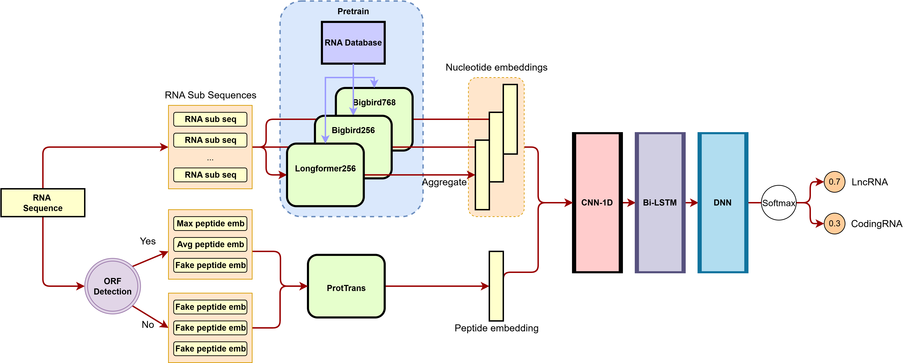

# LncPNdeep

**LncPNdeep** is a deep learning framework for classifying long non-coding RNA (lncRNA) versus coding RNA from nucleotide FASTA sequences. It integrates RNA-level representations from pretrained BigBird/Longformer models with peptide-level representations from ProtBERT, then fuses them in a downstream neural classifier.

<p align="center">
  
</p>

| Resource | Link |
| --- | --- |
| Code | [github.com/yatoka233/LncPNdeep](https://github.com/yatoka233/LncPNdeep) |
| Weights | [huggingface.co/yatoka/LncPNdeep](https://huggingface.co/yatoka/LncPNdeep) |
| Preprint | [bioRxiv 10.1101/2023.11.29.569323](https://www.biorxiv.org/content/10.1101/2023.11.29.569323v1) |

---

## Method overview

LncPNdeep uses a **two-stage, multi-modal** deep learning design (see figure above):

### 1. Nucleotide embedding extraction

Input RNA sequences are tokenized at **k-mer = 1**. Long sequences are split into overlapping segments (1,000–2,000 nt) and passed through three independently pretrained RNA masked language models:

| Model | Architecture | Embedding dim | Role |
| --- | --- | --- | --- |
| **Longformer256** | Longformer (4 layers, 8 heads) | 256 | Long-range nucleotide context |
| **Bigbird256** | BigBird (4 layers, 8 heads) | 256 | Sparse attention nucleotide features |
| **Bigbird768** | BigBird (12 layers, 12 heads) | 768 | Higher-capacity nucleotide features |

For each segment, the **\[CLS\] token** hidden state is taken as the segment embedding. Segment embeddings are averaged to produce one fixed-length vector per input sequence per model.

### 2. Peptide embedding extraction

Each RNA sequence is translated in **three reading frames**. Open reading frames yielding peptides longer than 100 amino acids are encoded with **[ProtBERT](https://huggingface.co/Rostlab/prot_bert)** (`Rostlab/prot_bert`). Three aggregation strategies are used:

| Embedding | Description |
| --- | --- |
| **Average** | Sum of ProtBERT embeddings over all qualifying peptides |
| **Fake** | ProtBERT embedding of the full forward translation |
| **Max** | ProtBERT embedding of the longest qualifying peptide |

### 3. Final classification

Six input embeddings are fed to a deep learning classifier (`ProteinTransAllfeature_ResCNN2_07_08.h5`):

1. Average peptide embedding  
2. Fake peptide embedding  
3. Max peptide embedding  
4. Bigbird256 nucleotide embedding  
5. Bigbird768 nucleotide embedding  
6. Longformer256 nucleotide embedding  

The fused features pass through **1D-CNN → Bi-LSTM → DNN → Softmax**. The model outputs a **2-class softmax**: column 0 = lncRNA probability, column 1 = coding RNA probability.

---

## Installation

```bash
git clone https://github.com/yatoka233/LncPNdeep.git
cd LncPNdeep
pip install -r requirements.txt
python download_weights.py
```

Weights (~2.8 GB) are hosted on Hugging Face and are **not** stored in this repository.

```bash
python download_weights.py --check
```

**Requirements:** Python 3.10 or 3.11, TensorFlow 2.15, PyTorch, transformers. CPU or CUDA.

---

## Usage

### Classification

```bash
python predict_lncrna.py \
  --input_fasta your_sequences.fasta \
  --output_dir results/ \
  --result_txt results/prediction_results.txt
```

Or download weights automatically on first run:

```bash
python predict_lncrna.py --download_weights --input_fasta your_sequences.fasta --output_dir results/
```

**Output format** (`prediction_results.txt`):

```
sequence_name    lncRNA_probability    codingRNA_probability    is_lncRNA
```

### Nucleotide embeddings only

```bash
python extract_nucleotide_embeddings.py \
  --input_fasta your_sequences.fasta \
  --output_dir embeddings/ \
  --model all
```

---

## Repository structure

```
LncPNdeep/
├── lnc.png                        # Model pipeline figure
├── predict_lncrna.py              # Full prediction pipeline (start here)
├── extract_nucleotide_embeddings.py
├── download_weights.py            # Download weights from Hugging Face
├── requirements.txt
├── simulation_and_pretrain_code/  # Original pretraining & simulation code
│   ├── model/
│   ├── pretrain.py, run.py, feature.py, ...
│   └── weights/pretrain/          # Created by download_weights.py (gitignored)
└── ProteinTransAllfeature_ResCNN2_07_08.h5   # Downloaded to repo root (gitignored)
```

---

## Citation

If you use LncPNdeep, please cite our preprint:

> **LncPNdeep** — bioRxiv (2023).  
> https://doi.org/10.1101/2023.11.29.569323  
> https://www.biorxiv.org/content/10.1101/2023.11.29.569323v1

```bibtex
@article{lncpndeep2023,
  title   = {LncPNdeep},
  journal = {bioRxiv},
  year    = {2023},
  doi     = {10.1101/2023.11.29.569323},
  url     = {https://www.biorxiv.org/content/10.1101/2023.11.29.569323v1}
}
```
